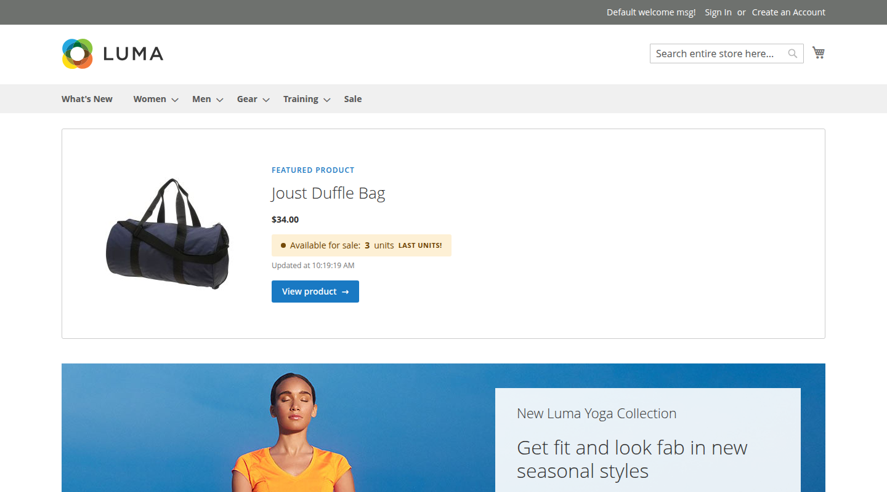
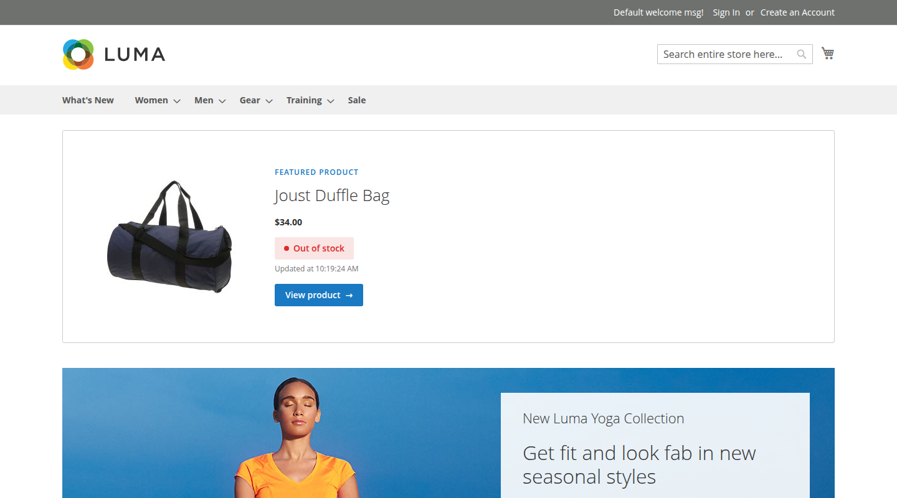
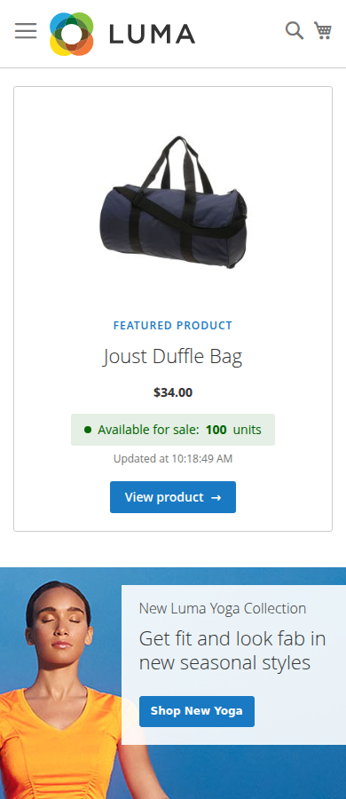

# Crevellari_FeaturedProduct

[](https://github.com/crevellarivinicius/cvlr-module-featured-product/actions/workflows/ci.yml)


[English](README.md) · **Português (Brasil)**

Módulo para Magento 2 que exibe um **produto em destaque na homepage** com a **quantidade disponível para venda atualizada em tempo quase real** — sem recarregar a página.


| Estoque baixo | Esgotado | Mobile |
|---|---|---|
|  |  |  |

## Funcionalidades

- Box de produto em destaque como **primeiro elemento do conteúdo principal da homepage**, largura total, com título, preço (pricing render pipeline nativo), imagem base e link para a página do produto;
- **Quantidade disponível para venda em tempo real** — a *salable quantity* do MSI (estoque físico menos reservas), consultada por um componente Knockout em intervalo configurável;
- **Polling barato**: o endpoint emite `ETag` e responde `304 Not Modified` vazio enquanto nada muda; o polling pausa quando a aba do navegador está oculta;
- Produto selecionado **por SKU no painel admin** (validado no salvamento), com intervalo de atualização e limite de estoque baixo — tudo com escopo de store view;
- Estados de estoque baixo ("Últimas unidades!"), esgotado e erro de rede, estilizados com as cores de mensagem do próprio tema Luma;
- **Full Page Cache da homepage invalidado automaticamente** quando o produto em destaque muda (`IdentityInterface`);
- O mesmo service contract atende o storefront, um **endpoint REST** e uma **query GraphQL**;
- **Pronto para Hyvä**: o módulo inclui uma variação do template em Alpine.js/Tailwind;
- Traduções `en_US` e `pt_BR`, testes unitários e de integração, CI com o coding standard do Magento.

Nenhum arquivo de tema é modificado: tudo vive dentro do módulo.

## Instalação

### Composer

```bash
composer require crevellari/module-featured-product
bin/magento module:enable Crevellari_FeaturedProduct
bin/magento setup:upgrade
bin/magento setup:di:compile   # modo production
bin/magento cache:flush
```

A partir de um clone local (path repository):

```bash
composer config repositories.crevellari path extensions/crevellari/module-featured-product
composer require crevellari/module-featured-product:@dev
```

### app/code

```bash
mkdir -p app/code/Crevellari/FeaturedProduct
# copie o conteúdo do módulo para a pasta acima
bin/magento module:enable Crevellari_FeaturedProduct
bin/magento setup:upgrade
bin/magento cache:flush
```

## Configuração

**Stores → Configuration → Catalog → Featured Product**

| Campo | Descrição | Padrão |
|---|---|---|
| Enabled | Liga/desliga o box na homepage | Sim |
| Product SKU | SKU do produto em destaque — validado contra o catálogo no salvamento | `24-MB01` |
| Stock Refresh Interval (seconds) | Intervalo do polling (5–300s, validado também no servidor) | 10 |
| Low Stock Threshold | Quantidade igual/abaixo da qual o box destaca "Últimas unidades!" (0 desativa) | 5 |

Todos os campos têm **escopo de store view** e botão *Use system value* (`canRestore`).

## Como funciona a atualização em tempo real

1. O componente Knockout (`view/frontend/web/js/view/stock.js`) faz uma requisição no carregamento e agenda um `setInterval` com o intervalo configurado;
2. Cada ciclo chama `GET /featuredproduct/stock/get` — um controller fino (`HttpGetActionInterface`) que só delega ao service contract e formata o JSON;
3. O service (`Api\StockInformationInterface` → `Model\StockInformation`) lê a salable quantity do MSI (`GetProductSalableQtyInterface`) resolvida para o website atual, com fallback para o estoque legado em tipos de produto sem source item;
4. A resposta atualiza os observables e o template Knockout re-renderiza apenas o indicador de estoque.

Detalhes de controle de custo:

- O número exibido é a **salable quantity** (físico − reservas): cai no momento em que um pedido é feito, sem reindexação;
- As respostas carregam **`ETag`**; o componente envia `If-None-Match`, então polls sem mudança voltam como **304** vazio (o [ADR 0001](docs/adr/0001-polling-with-etag-over-push.md) documenta por que isso supera SSE/WebSocket neste contexto);
- O polling **pausa com a aba oculta** (Page Visibility API) e atualiza imediatamente no retorno;
- Em falha de rede, o último valor conhecido permanece na tela com um aviso discreto, e o componente continua tentando;
- O SKU nunca trafega na requisição — o endpoint lê a configuração no servidor.

## APIs

O mesmo service contract é exposto via REST:

```
GET /rest/V1/featured-product/stock
```

E via GraphQL:

```graphql
{
    featuredProductStock {
        sku
        qty
        is_salable
        updated_at
    }
}
```

A query GraphQL é marcada como não-cacheável, coerente com a natureza em tempo real do dado.

## Hyvä

Uma variação do box em Alpine.js + Tailwind CSS acompanha o módulo em
`view/frontend/templates/hyva/product.phtml` (mesmo view model, `fetch` com
`If-None-Match`, polling sensível à visibilidade da aba). Aponte o template do
bloco para ela no seu tema Hyvä, ou mapeie via
[hyva-themes/module-compat-module-fallback](https://gitlab.hyva.io/hyva-themes/magento2-compat-module-fallback).

## Arquitetura

| Camada | Arquivos | Papel |
|---|---|---|
| Service contract | `Api/StockInformationInterface` + `Model/StockInformation` | Dono único da regra de estoque, consumido pelo controller, REST, GraphQL e render server-side |
| DTO | `Api/Data/StockInterface` + `Model/Data/Stock` | Payload tipado |
| Controller | `Controller/Stock/Get.php` | Fino: HTTP → service → JSON, mais o handshake ETag/304 |
| GraphQL | `etc/schema.graphqls` + `Model/Resolver/FeaturedProductStock` | Resolver delegando ao mesmo service |
| ViewModel | `ViewModel/FeaturedProduct.php` | Dados do produto para o template (sem fat blocks) |
| Block | `Block/FeaturedProduct.php` | Mescla config de runtime no `jsLayout` declarado (padrão do checkout) e expõe cache identities para invalidação do FPC |
| Layout | `view/frontend/layout/cms_index_index.xml` | Reference container/block, block arguments, CSS carregado só na homepage |
| JS | `view/frontend/web/js/view/stock.js` | `uiComponent` Knockout carregado via RequireJS só onde é usado |
| Config admin | `etc/adminhtml/system.xml` + `Model/Config/Backend/Sku` | Seção própria, ACL, defaults e validação do SKU no salvamento |

Mecanismos nativos de layout demonstrados: bloco declarado via `referenceContainer`/`referenceBlock`, configurado com **block arguments** (view model, título, `jsLayout`), estrutura do jsLayout declarada no XML e enriquecida em runtime por `Block::getJsLayout()`, e componente **Knockout** com template KO próprio.

### Design alinhado ao Luma

Nenhum vocabulário visual inventado: os estados de estoque reutilizam as cores
de mensagem do tema (success `#e5efe5/#006400`, warning `#fdf0d5/#6f4400`,
error `#fae5e5/#e02b27`), o CTA reproduz o botão primário do Luma (`#1979c3`,
hover `#006bb4`, radius 3px), o título usa o `font-weight: 300` do tema e as
bordas/textos secundários usam os cinzas padrão. O box parece parte nativa do
tema.

### Outros cuidados

- `declare(strict_types=1)` e tipagem completa; DI por construtor, sem ObjectManager direto, sem lógica em template ou controller;
- Acessibilidade: `aria-live` restrito à faixa de quantidade, foco visível, suporte a `prefers-reduced-motion`, alt da imagem vindo do catálogo;
- SKU inexistente ou módulo desabilitado nunca quebram a homepage — o box simplesmente não renderiza (com aviso no log);
- Estados visuais completos: valor inicial renderizado no servidor (sem flash vazio), pulso na atualização, estoque baixo, esgotado, erro de rede.

## Testes

Testes unitários (a partir de uma instalação Magento):

```bash
cd dev/tests/unit
../../../vendor/bin/phpunit ../../../app/code/Crevellari/FeaturedProduct/Test/Unit
```

Testes de integração (exigem o [framework de testes de integração](https://developer.adobe.com/commerce/testing/guide/integration/)):

```bash
cd dev/tests/integration
../../../vendor/bin/phpunit ../../../app/code/Crevellari/FeaturedProduct/Test/Integration
```

O CI roda checagem de sintaxe em PHP 8.1/8.2 e `phpcs` com o ruleset `Magento2` a cada push.

## Compatibilidade

- Magento 2.4.6 Open Source (PHP 8.1/8.2), tema Luma; variação de template para Hyvä incluída.

## Licença

[OSL-3.0](COPYING.txt) — a mesma licença do Magento Open Source.
Notas de versão em [CHANGELOG.md](CHANGELOG.md).
